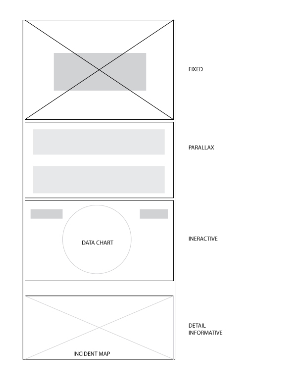

# Unhitched
The Community Cat app is about cats, and it's built on rails. 
---
# User Stories
* As a user, I can view the entire site.
* As a user, I can interact with the data.
* As a user, I educate myself on the carriage industry.

# Media
### Wireframe

# Special Thanks
This project would not have been possible without the contributions of the following people and technologies:
* The Dream Team of instructors at GA: Jason, Bobby, and Serge
* Mike OG, Fizal, Katty Data Scientist, 
* The many people, institutions, and organizations who sourced the data for this project
*  Node, Javascript/jQuery, PSQL, StackOverflow, Google, the internet, Google Fonts, ScrollMagic, Chart.js.

This data was handcrafted from the following sources: www.nycclass.org, www.nyc.gov, www.banhdc.org, and the aldf.org
---
